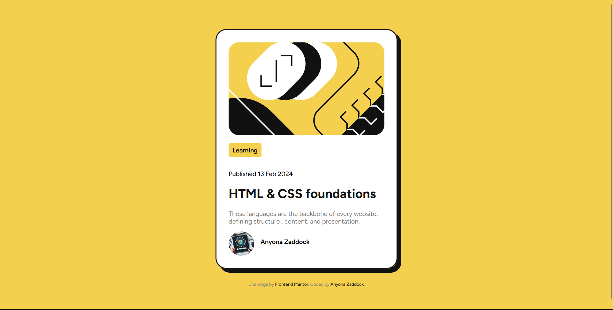
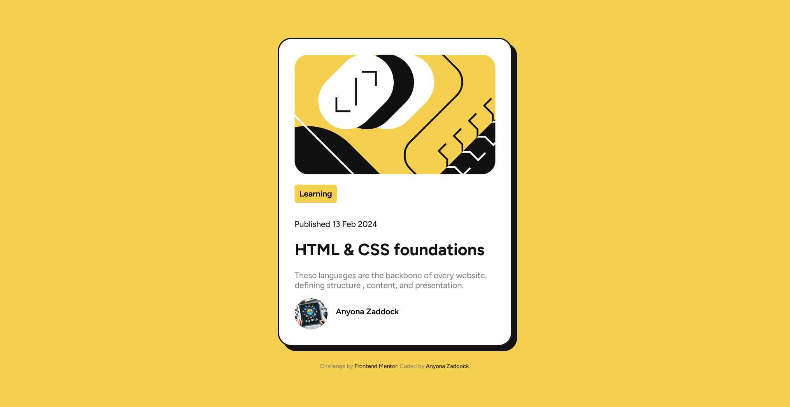
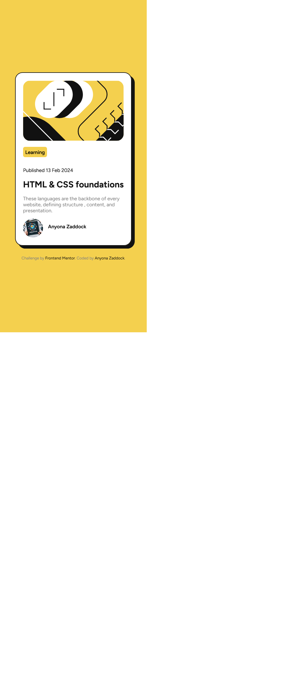

# Frontend Mentor - Blog preview card solution

This is a solution to the [Blog preview card challenge on Frontend Mentor](https://www.frontendmentor.io/challenges/blog-preview-card-ckPaj01IcS). Frontend Mentor challenges help you improve your coding skills by building realistic projects. 

## Table of contents

- [Overview](#overview)
  - [The challenge](#the-challenge) 
  - [My Solution Screenshots](#screenshot)
  - [Links](#links)
- [My process](#my-process)
  - [Built with](#built-with)
  - [What I learned](#what-i-learned) 
  - [Useful resources](#useful-resources)
- [Author](#author)
- [Acknowledgments](#acknowledgments)


## Overview
  This project is a beginner-level project for those who are starting their learning journey with CSS. Through this challenge, participants get to implement display properties to structure the content's of the web page in accordance to the design images provided.
  One my mistake this project to be a test of display properties for CSS. No. In fact this project guidelines does not restrict you. You can use any web technology to complete this challenge so long as your web page ressembles the designs in the images.
### The challenge

Users should be able to:

- See hover and focus states for all interactive elements on the page

### Screenshot





### Links

- Solution URL: [GitHub](https://github.com/zacc-anyona/Blog-Peview-Card-Challenge-by-Frontend-Mentor-)
- Live Site URL: [View with Netlify](https://blog-preview-page-frontend-mentor.netlify.app/)
- Live Site URL: [View with Vercel](https://blog-peview-card-challenge-by-frontend-mentor.vercel.app/)

## My process
  - Understood the challege's requirements and instructions.
  - Marked up the whole content with HTML5 first before styling it up.
  - Used the mobile-design first approach.
### Built with

- Semantic HTML5 markup
- CSS custom properties
- Flexbox
- Mobile-first workflow

### What I learned

  In this challenge my main and major lesson was centering contents of a web page efficeintly both vertically and horizontally.
  I learned this from a member of a Frontend Mentor community. He is good. @danielmrz-dev
```css
body {
  min-height: 100vh;
  display: flex;
  justify-content: center;
  align-items: center;
}
```

## Author

- Frontend Mentor - [@zacc-anyona](https://www.frontendmentor.io/profile/zacc-anyona)
- Twitter - [@anyona_zadocc](https://twitter.com/anyona_zadocc)

## Acknowledgments

  First, I want to thank myself for taking up the time to finish this challenge. I did my best.

  Secondly, I want to thank **@danielmrz-dev** who is a member of Frontend Mentor community who in my previous challenge (*Social Links Profile*) educated me through his comment, on the most efficient way to center contents of a web page. Thank you.
